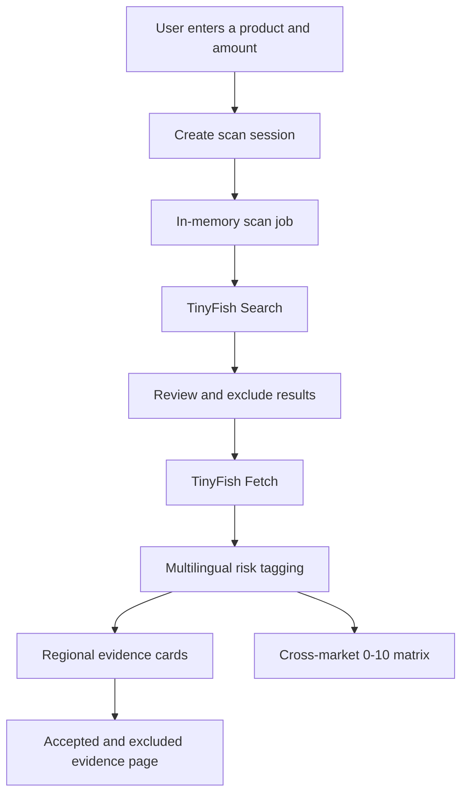
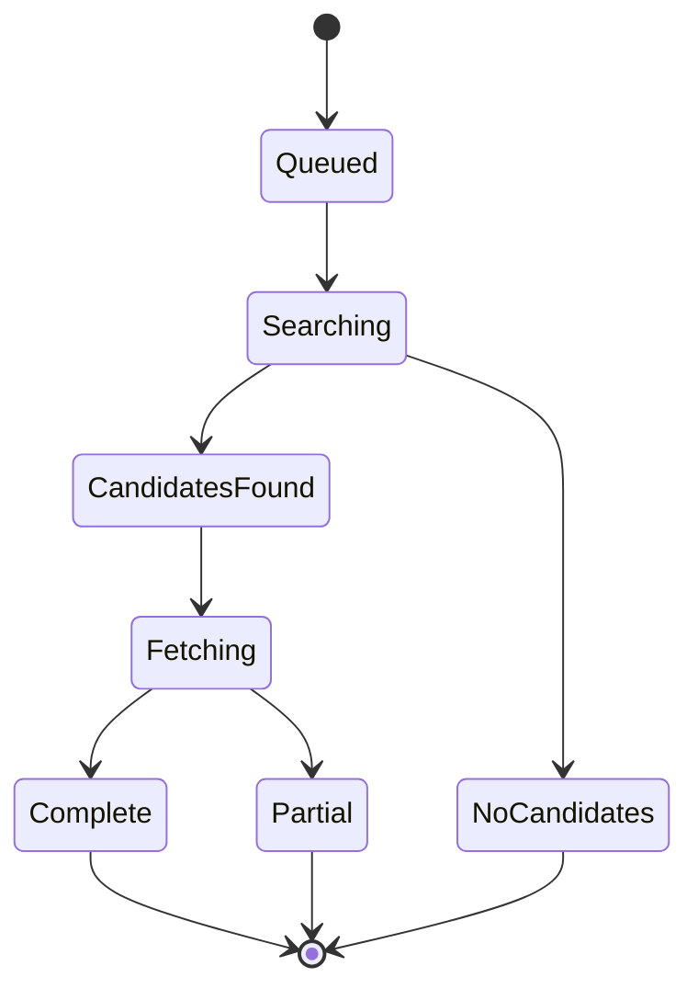

# PRODUCT RISK ATLAS

**Cross-market product recall intelligence powered by TinyFish Search and Fetch.**

Product Risk Atlas takes one product name, searches official recall sources across eight major markets, fetches the strongest evidence, and turns fragmented notices into regional risk rankings with traceable source links.

## What It Does

- Scans the United States, European Union, United Kingdom, Canada, Australia, Mainland China, Japan and South Korea.
- Reviews 5-30 TinyFish Search results per market.
- Separates accepted recall evidence from excluded search results and explains every exclusion.
- Fetches official detail pages and preserves search snippets when a source cannot be read reliably.
- Scores recurring risk signals from 0-10 for each market.
- Streams live progress into eight regional cards while the scan is running.
- Gives every scan a session ID so progress survives refreshes, detail navigation and browser back.

## TinyFish Integration

| Stage | TinyFish operation | Purpose |
| :--- | :--- | :--- |
| Discovery | `client.search.query()` | Find ranked results from each market's official recall authority. |
| Pagination | Search `page` parameter | Review up to 30 results without expanding or rewriting the product query. |
| Validation | Deterministic URL rules | Separate individual recall records from indexes, guidance and unrelated pages. |
| Evidence | `client.fetch.getContents()` | Read accepted official pages in parallel and extract clean text. |
| Analysis | Multilingual risk dictionary | Tag recurring hazards and calculate regional 0-10 risk signals. |

Search and Fetch are used for the shortest reliable research path. The application does not send an autonomous browser agent across all eight sites.

## System Architecture



### Scan Lifecycle



Each market publishes real progress events. A completed card replaces its skeleton immediately without waiting for the other markets.

## Evidence Review

TinyFish Search returns up to ten results per page. Product Risk Atlas reviews the selected amount for every market and keeps both sides of the decision:

- **Accepted evidence** contains individual official recall records used in risk scoring.
- **Excluded search results** contains indexes, guidance, unrelated pages and failed fetches with an explicit exclusion reason.

The regional card previews three accepted records. `View all N reviewed records` opens the complete accepted and excluded result set for that scan session.

## Risk Scoring

The score describes recall signal frequency, not real-world incident probability.

```text
risk score = records mentioning the risk / accepted records x 10
```

A score of `8.0` means that 80% of the accepted recall records for that market mention the risk. Higher scores indicate stronger recall risk signals in the collected evidence.

## Server-Side Sessions

Starting a scan creates a server-side session ID:

```text
/?scan=<session-id>
/market.html?market=US&scan=<session-id>
```

The server keeps task events and market results in memory for one hour. Leaving the page does not stop the TinyFish work. Returning to the scan URL replays the saved events and restores the current UI state.

This demo uses no database. Restarting the server clears active and completed scan sessions.

## API Key Security

The app supports two key paths:

1. **Demo key**: `TINYFISH_API_KEY` exists only in the server process environment.
2. **Bring Your Own Key**: an optional user key is sent for one scan and is never added to session events, URLs, browser storage or API responses.

Use HTTPS in production so user-provided keys are encrypted in transit. Never commit a real `.env` file. Rotate any key that has been exposed.

## Getting Started

### Prerequisites

- Node.js 20+
- A TinyFish API key from [TinyFish](https://agent.tinyfish.ai/)

### Install

```bash
git clone https://github.com/ChRonicen/product-risk-atlas.git
cd product-risk-atlas
npm install
```

### Configure

Set the demo key in the server environment:

```bash
export TINYFISH_API_KEY=your_key
export PORT=4173
```

`.env.example` documents the required variables. The application does not load `.env` automatically.

### Run

```bash
npm start
```

Open [http://localhost:4173](http://localhost:4173).

### Run the Scanner as a Script

```bash
TINYFISH_API_KEY=your_key npm run scan -- "power bank"
```

The command prints the complete structured result as JSON.

## VPS Deployment

Install production dependencies and inject secrets through the process manager or service unit:

```bash
npm ci --omit=dev
TINYFISH_API_KEY=your_key PORT=4173 npm start
```

Place a reverse proxy such as Caddy or Nginx in front of the Node server and enable HTTPS before exposing Bring Your Own Key publicly.

## Project Structure

```text
product-risk-atlas/
├── public/
│   ├── index.html       # Scan interface
│   ├── app.js           # Progress restoration and UI state
│   ├── market.html      # Regional evidence page
│   ├── market.js        # Accepted and excluded result rendering
│   └── styles.css       # Responsive light and dark themes
├── scripts/
│   └── risk-scan.mjs    # TinyFish Search, Fetch and risk pipeline
├── research/
│   ├── experiment-protocol.md
│   └── product-scopes.json
├── server.mjs           # HTTP server and scan session store
├── .env.example
└── package.json
```

## Current Constraints

| Constraint | Current behavior |
| :--- | :--- |
| Persistent database | No. Scan sessions are in memory. |
| Session lifetime | One hour. |
| Source scope | Fixed official authority per market. |
| Search amount | 5-30 results per market, in increments of 5. |
| Risk interpretation | Frequency in accepted recall evidence, not incident probability. |
| Fetch fallback | Search snippet retained when official page text is too short. |

## Tech Stack

- Node.js HTTP server
- Vanilla JavaScript and CSS
- [`@tiny-fish/sdk`](https://www.npmjs.com/package/@tiny-fish/sdk)
- TinyFish Search and Fetch

## Disclaimer

Product Risk Atlas is a research prototype. It summarizes public recall evidence and does not replace legal, regulatory, engineering or product safety review. Always verify findings against the linked official sources.
