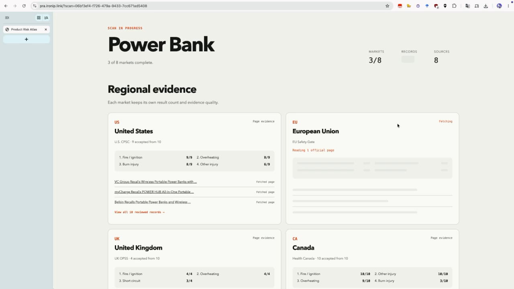

# PRODUCT RISK ATLAS

**Live Demo:** [pra.ironip.link](https://pra.ironip.link)

**Cross-market product recall intelligence powered by TinyFish Search and Fetch.**

Enter a product name and choose how many results to review. Product Risk Atlas searches official recall authorities across eight major markets, filters individual recall records from irrelevant results, fetches the accepted evidence, and builds regional risk rankings with direct source links.

## Demo

**Video Walkthrough:** [Watch the 43-second demo](https://github.com/ChRonicen/product-risk-atlas/blob/agent/demo-rate-limit/assets/product-risk-atlas-demo.mp4)

[](assets/product-risk-atlas-demo.mp4)

## Architecture

```text
┌─────────────────────────────────────────────────────────────┐
│                      Browser (Client)                       │
│                                                             │
│  Product input → Amount slider → Regional cards             │
│  Live market status → Risk matrix → Evidence detail page    │
└──────────────────────────┬──────────────────────────────────┘
                           │ POST /api/scans
                           │ GET  /api/scans/:id
┌──────────────────────────▼──────────────────────────────────┐
│                 Node.js Scan Orchestrator                   │
│                                                             │
│  Server-side session store                                  │
│    │                                                        │
│    ├─ TinyFish Search ──► 8 official authority domains      │
│    │     page 1-3, based on selected amount                 │
│    │                                                        │
│    ├─ Result review ──► accepted + excluded records         │
│    │                                                        │
│    └─ TinyFish Fetch ──► accepted official detail pages     │
│                                                             │
│  Multilingual risk tags → regional scores → session events  │
└─────────────────────────────────────────────────────────────┘
```

No database. Scan sessions and progress events are stored in memory for one hour.

### TinyFish SDK flow

```text
client.search.query({ query, page })
  │
  ├── 5-30 ranked results per market
  ├── deterministic URL review
  │     ├── accepted: individual recall record
  │     └── excluded: index, guidance, unrelated page
  │
  └── client.fetch.getContents({ urls })
        ├── fetched page evidence
        └── search snippet fallback
```

## Features

- Search **8 markets**: US, EU, UK, Canada, Australia, Mainland China, Japan and South Korea
- Review **5-30 results per market** in increments of 5
- Watch each market move through **Queued → Searching → Fetching → Complete**
- See completed regional cards immediately without waiting for the slowest market
- Compare recurring risk signals on a **0-10 scale**
- Preview the top three accepted records on each market card
- Open all reviewed results, split into **Accepted Evidence** and **Excluded Search Results**
- Restore active scans after refresh, detail navigation, or browser back using a scan session ID
- Use the server demo key or optionally **Bring Your Own TinyFish Key**

## Search and Review Flow

1. User enters a product and selects the number of results per market
2. `POST /api/scans` creates an in-memory scan session
3. TinyFish Search queries each official authority with a localized product term
4. Search pagination supplies up to 30 ranked results without expanding the product query
5. Deterministic URL rules separate individual recall records from excluded results
6. TinyFish Fetch reads accepted official pages in parallel
7. A multilingual dictionary tags fire, overheating, burns, explosion, short circuit, swelling, chemical and injury signals
8. The UI polls the scan session and restores every completed market from saved events

## Risk Score

```text
risk score = records mentioning the risk / accepted records x 10
```

A score of `8.0` means 80% of the accepted recall records for that market mention the risk. The score measures signal frequency in the collected recalls, not real-world incident probability.

## Setup

### Prerequisites

- Node.js 20+
- TinyFish API key

### Environment Variables

Use `.env.example` as a reference and inject the demo key into the server process:

```env
TINYFISH_API_KEY=your-tinyfish-api-key
PORT=4173
```

The server never returns the demo key to the browser.

Bring Your Own Key is optional. A user key is used for one scan and is never stored in session events, URLs, browser storage, or API responses. Use HTTPS in production.

### Install and Run

```bash
npm install
TINYFISH_API_KEY=your_key npm start
```

Open http://localhost:4173

### CLI Scanner

```bash
TINYFISH_API_KEY=your_key npm run scan -- "power bank"
```

The CLI prints the complete structured scan result as JSON.

## Deployment

Any Node-compatible VPS works. Install production dependencies, inject `TINYFISH_API_KEY` through the process manager, and place Caddy or Nginx with HTTPS in front of the app.

```bash
npm ci --omit=dev
TINYFISH_API_KEY=your_key PORT=4173 npm start
```

## Project Structure

```text
product-risk-atlas/
├── public/
│   ├── index.html       # Search form, amount selector and results layout
│   ├── app.js           # Scan session polling and progressive card updates
│   ├── market.html      # Full regional evidence page
│   ├── market.js        # Accepted and excluded result rendering
│   └── styles.css       # Responsive light and dark UI
├── scripts/
│   └── risk-scan.mjs    # TinyFish Search, Fetch and scoring pipeline
├── research/
│   ├── experiment-protocol.md
│   └── product-scopes.json
├── server.mjs           # HTTP API and in-memory scan sessions
├── .env.example
└── package.json
```

## Constraint Checklist

| Constraint | Status |
|---|---|
| External database used? | NO (pure in-memory) |
| Fixed official sources? | YES (one authority per market) |
| Search pagination? | YES (up to 3 pages per market) |
| Accepted and excluded evidence visible? | YES |
| Progressive market status? | YES (session event polling) |
| Navigation-safe scans? | YES (server-side scan ID) |
| Demo key exposed to browser? | NO |
| Bring Your Own Key stored? | NO |

## Tech Stack

- **Server:** Node.js HTTP server
- **Frontend:** Vanilla JavaScript and CSS
- **Web Data:** TinyFish SDK (`client.search.query`, `client.fetch.getContents`)
- **State:** In-memory scan sessions with one-hour cleanup
- **Deployment:** Node-compatible VPS behind HTTPS

## Disclaimer

Product Risk Atlas is a research prototype. It summarizes public recall evidence and does not replace legal, regulatory, engineering, or product safety review. Always verify findings against the linked official sources.
